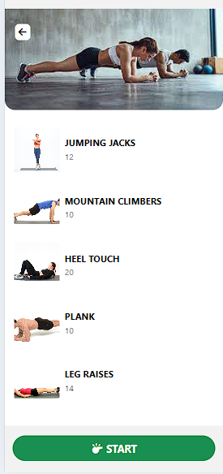
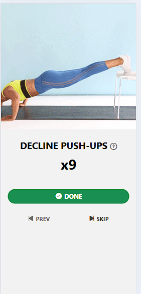
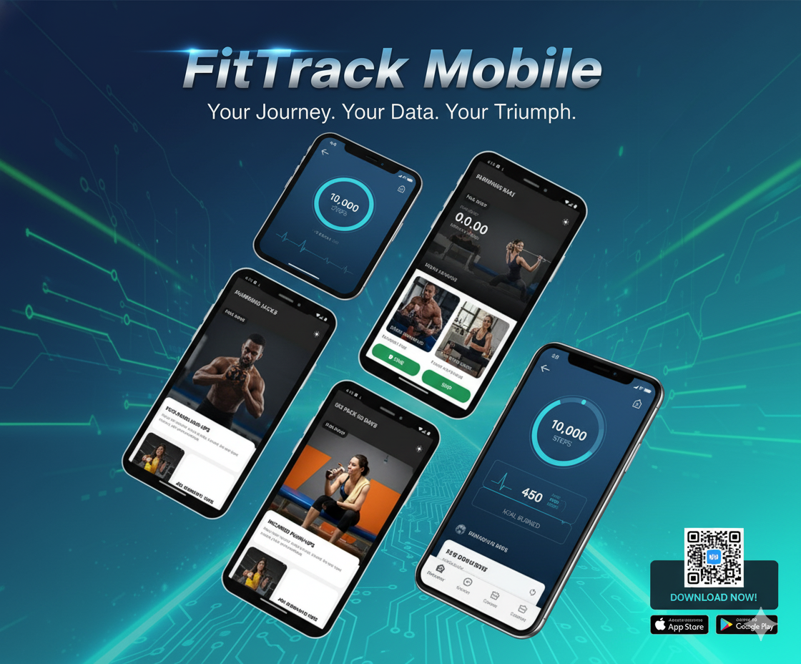

<div align="center">

# 💪 FitTrack Mobile

### A React Native Fitness Tracking Application

_Track your workouts, monitor your progress, and achieve your fitness goals_


</div>

---

## 📱 About The Project

FitTrack Mobile is a comprehensive fitness tracking application built with React Native and Expo. The app features four intuitive screens designed to help users manage their fitness journey effectively. Whether you're a beginner or a seasoned athlete, FitTrack provides the tools you need to stay motivated and track your progress.

### ✨ Key Features

- **Home Dashboard** - Quick overview of your daily fitness stats and recent activities
- **Workout Library** - Browse and select from a variety of exercises and workout routines
- **Rest Timer** - Built-in rest timer to optimize your workout sessions
- **Progress Tracking** - Monitor your fitness journey with detailed workout history and statistics

---

## 📸 Screenshots

<div align="center">

### Home Screen


### Exercise Screen



### Workout Screen



### Rest Screen


### Complete App Demo



</div>

---

## 🚀 Getting Started

Follow these steps to get the app running on your local machine.

### Prerequisites

- Node.js (v14 or higher)
- npm or yarn
- Expo CLI
- iOS Simulator or Android Emulator (optional)

### Installation

1. **Clone the repository**

   ```bash
   git clone https://github.com/prakhaaar/fittrack-mobile.git
   cd fittrack-mobile
   ```

2. **Install dependencies**

   ```bash
   npm install
   ```

3. **Start the development server**
   ```bash
   npm start
   ```

---

## 🎯 Available Scripts

### `npm start`

Launches the Expo development server. Scan the QR code with the Expo Go app on your mobile device to view the app.

### `npm run android`

Starts the development server and opens the app on a connected Android device or emulator.

### `npm run ios`

Starts the development server and opens the app in the iOS Simulator (macOS only).

### `npm run web`

Opens the app in your web browser for web-based testing.

---

## 🏗️ Project Structure

```
fittrack-mobile/
├── .expo/
├── assets/
│   ├── adaptive-icon.png
│   ├── favicon.png
│   ├── icon.png
│   └── splash.png
├── components/
│   └── FitnessCards.js
├── data/
│   └── fitness.js
├── screens/
│   ├── FitScreen.js
│   ├── HomeScreen.js
│   ├── RestScreen.js
│   └── WorkoutScreen.js
├── .gitignore
├── App.js
├── app.json
├── babel.config.js
├── package.json
└── README.md
```

---

## 🛠️ Built With

- **React Native** - Cross-platform mobile framework
- **Expo** - Development platform for React Native
- **React Navigation** - Routing and navigation for React Native apps
- **JavaScript (ES6+)** - Programming language

---

## 🎨 App Screens

1. **Home Screen** - Main dashboard with workout overview and quick actions
2. **Fit Screen** - Exercise selection and workout customization
3. **Workout Screen** - Active workout tracking with exercise instructions
4. **Rest Screen** - Countdown timer for rest periods between sets

---

## 🤝 Contributing

Contributions are what make the open-source community such an amazing place to learn, inspire, and create. Any contributions you make are **greatly appreciated**.

1. Fork the Project
2. Create your Feature Branch (`git checkout -b feature/AmazingFeature`)
3. Commit your Changes (`git commit -m 'Add some AmazingFeature'`)
4. Push to the Branch (`git push origin feature/AmazingFeature`)
5. Open a Pull Request

---

## 📝 License

This project is **free to use** and does not contain any license.

---

## 📧 Contact

For questions, suggestions, or feedback, feel free to reach out:

- **GitHub**: [@prakhaaar](https://github.com/prakhaaar)
- **LinkedIn**: [Prakhar Mishra](https://www.linkedin.com/in/prakhar-mishra-52b71a257/)
- **Email**: mprakhar07@gmail.com

---

## 🙏 Acknowledgments

- Icons and images from various open-source resources
- Fitness data and exercise information from public fitness databases
- React Native and Expo communities for excellent documentation and support

---

<div align="center">

**Made with ❤️ and React Native**

⭐ Star this repository if you find it helpful!

</div>
